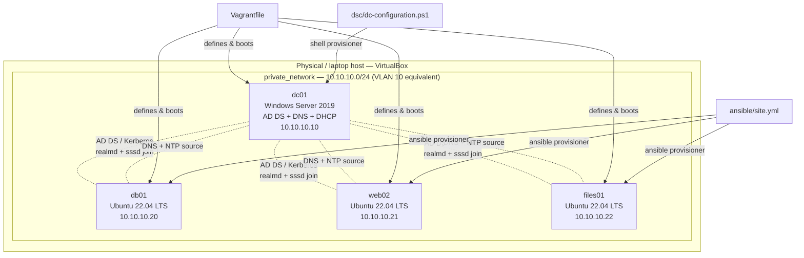

# ad-linux-homelab-iac

Infrastructure-as-code implementation of the practice lab described in
[`it-helpdesk-sysadmin-portfolio`](https://github.com/John-Axe/it-helpdesk-sysadmin-portfolio)'s
[`network-lab/topology.md`](https://github.com/John-Axe/it-helpdesk-sysadmin-portfolio/blob/main/network-lab/topology.md):
one Windows Server AD domain controller (AD DS + DNS + DHCP) and a small
Ubuntu Server fleet, domain-joined via `realmd`/`sssd`, on a private lab
network.

## Problem

The sibling repo documents that lab as a manual build guide: click through
Server Manager, promote the DC by hand, `realm join` each Linux box one at
a time. That's fine for a one-off walkthrough, but it doesn't scale and it
doesn't match how a real sysadmin actually manages infrastructure they
expect to rebuild — after a snapshot goes bad, a lab gets wiped for a new
scenario, or the environment needs to be handed to someone else to
reproduce.

This repo is the IaC version of the same topology: `vagrant up` and get the
same four-VM environment, defined in version-controlled code instead of a
sequence of screenshots. That's also the resume-relevant point — "I can
click through Server Manager" is a much weaker claim than "I can define
infrastructure as code, check it into git, and reproduce it on demand,"
which is the actual expectation for a sysadmin/IT role that touches any
amount of automation.

## Architecture



This repo provisions the **server tier** of the reference topology (VLAN
10 — Server/Infra). The router/firewall (pfSense) and VLAN 20 client
segment from the reference doc are out of scope here — they're
one-VM-per-role infrastructure pieces without a natural IaC story
(a Windows 11 client VM, an admin workstation) rather than something this
repo would provision headlessly. Domain: `contoso.local` — a placeholder,
matching the reference topology doc, not a real domain used anywhere in
this portfolio.

| Host | Role | IP | Provisioned by |
|---|---|---|---|
| `dc01` | AD DS + DNS + DHCP | `10.10.10.10` | `dsc/dc-configuration.ps1` |
| `db01` | Domain-joined Linux (database stand-in) | `10.10.10.20` | `ansible/site.yml` |
| `web02` | Domain-joined Linux (web/app stand-in) | `10.10.10.21` | `ansible/site.yml` |
| `files01` | Domain-joined Linux (file server stand-in) | `10.10.10.22` | `ansible/site.yml` |

## Repository layout

```
Vagrantfile              VM definitions, private network, provisioner wiring
dsc/
  dc-configuration.ps1    PowerShell DSC: AD DS promotion, DNS forwarder, DHCP scope
ansible/
  site.yml                Top-level playbook (common + domain_join roles)
  inventory.ini            Static inventory for the 3 Linux nodes
  group_vars/
    all.yml                 Non-secret lab defaults (domain name, IPs, packages)
    vault.yml.example        Template for the vaulted domain-join password
  roles/
    common/                 Hostname/DNS, baseline packages, NTP (chrony)
    domain_join/            realmd/sssd join, sssd.conf, sudoers for domain admins
scripts/
  check-prereqs.sh         Verifies VirtualBox/Vagrant/RAM/disk before `vagrant up`
  teardown.sh               `vagrant destroy` + local state cleanup
  apply-dsc.ps1             DC01's shell-provisioner entry point (reads DSC module deps,
                             compiles + applies dc-configuration.ps1)
LICENSE                   MIT
```

## Prerequisites

- [VirtualBox](https://www.virtualbox.org/wiki/Downloads) (6.1+)
- [Vagrant](https://developer.hashicorp.com/vagrant/install) (2.3+)
- A host with nested-virtualization-capable hardware (VT-x/AMD-V), **not**
  itself a container or a VM without nested virt exposed
- ~8GB free RAM and ~40GB free disk (dc01 alone wants 4GB RAM; the three
  Linux nodes are 1GB each)
- Internet access on first `vagrant up` to pull the Vagrant boxes
  (`gusztavvargadr/windows-server`, `ubuntu/jammy64`) and, for `dc01`,
  the DSC resource modules used by `dc-configuration.ps1`

Run `./scripts/check-prereqs.sh` to check all of the above automatically —
it verifies tool availability and available RAM/disk rather than asserting
it, and exits non-zero with a specific reason if something's missing.

## Usage

1. **Set the two required domain passwords** (never hard-coded anywhere in
   this repo — see `scripts/apply-dsc.ps1`):

   ```bash
   export AD_SAFEMODE_PASSWORD='<strong, unique password>'
   export AD_ADMIN_PASSWORD='<strong, unique password>'
   ```

2. **Set up the Ansible vault password** for the Linux domain-join account
   (see `ansible/group_vars/vault.yml.example`):

   ```bash
   cp ansible/group_vars/vault.yml.example ansible/group_vars/vault.yml
   $EDITOR ansible/group_vars/vault.yml   # set vault_domain_join_password
   ansible-vault encrypt ansible/group_vars/vault.yml
   ```

3. **Check prerequisites:**

   ```bash
   ./scripts/check-prereqs.sh
   ```

4. **Bring the DC up first** (the Linux nodes' domain-join step needs it
   reachable):

   ```bash
   vagrant up dc01
   ```

5. **Bring up the Linux fleet** (Ansible runs automatically on the last
   node, against all three, once `files01` is up):

   ```bash
   vagrant up db01 web02 files01
   ```

   Or bring everything up in one shot: `vagrant up` (Vagrant boots VMs in
   the order they're defined in the Vagrantfile, so `dc01` still comes up
   first).

6. **Verify:**

   ```bash
   vagrant ssh db01 -c "realm list"     # should show contoso.local
   vagrant ssh db01 -c "chronyc sources" # should show dc01 (10.10.10.10) as a source
   ```

7. **Tear down** when done:

   ```bash
   ./scripts/teardown.sh          # destroy VMs, keep cached boxes
   ./scripts/teardown.sh --full   # also remove cached boxes (re-downloads next time)
   ```

## Verification status (honest disclosure)

This repo was built and validated in a sandboxed Linux container **without
a hypervisor available** — no nested virtualization, no VirtualBox. In
line with this portfolio's existing pattern of disclosing what was and
wasn't actually run live (see
[`aws-auto-remediation`](https://github.com/John-Axe/aws-auto-remediation)'s
README on its LocalStack demo not running when Docker was unavailable),
here's exactly what was and wasn't verified in this environment:

| Component | Checked | Not done |
|---|---|---|
| `Vagrantfile` | `ruby -c Vagrantfile` — valid Ruby syntax | Never run through `vagrant up`/`vagrant validate` — no `vagrant` binary in this sandbox |
| `dsc/dc-configuration.ps1`, `scripts/apply-dsc.ps1` | Parsed with a portable pwsh 7.6.5 install (`[System.Management.Automation.Language.Parser]::ParseFile`); balanced-delimiter check; `dc-configuration.ps1`'s `Configuration` block re-parsed with the keyword swapped to `function` to validate general syntax without the CIM/DSC schema store | Never compiled to a MOF or applied — no Windows target, and pwsh on Linux can't natively parse the `Configuration` keyword without the (discontinued) PS DSC for Linux/OMI package, so full native DSC parsing wasn't possible either, only the function-swap workaround |
| `ansible/site.yml` + roles | `ansible-playbook --syntax-check -i ansible/inventory.ini ansible/site.yml` passed (via a local venv, `ansible-core` installed with `pip`); `ansible-inventory --list` confirmed the inventory and group_vars parse and resolve correctly | Never run against real hosts (`--check` or a live apply) — no Ubuntu VMs exist in this sandbox to target |
| `scripts/check-prereqs.sh`, `scripts/teardown.sh` | `bash -n` syntax check on both; `check-prereqs.sh` **run live** in this sandbox — see actual output below | `teardown.sh` not run live (nothing to tear down without VMs) |

`check-prereqs.sh` run live in this sandbox, unedited output:

```
== ad-linux-homelab-iac prerequisite check ==

-- Hypervisor / provisioning tools --
  [FAIL] VirtualBox (VBoxManage) not found on PATH. Install from https://www.virtualbox.org/wiki/Downloads
  [FAIL] Vagrant not found on PATH. Install from https://developer.hashicorp.com/vagrant/install
  [WARN] Packer not found (optional; only needed if you build your own boxes instead of using published ones)

-- Memory --
  [OK]   Available RAM: 29805MB (>= 8192MB recommended)

-- Disk space --
  [OK]   Free disk on $HOME filesystem: 933GB (>= 40GB recommended)

-- Virtualization extensions (best-effort) --
  [OK]   CPU virtualization extensions (VT-x/AMD-V) present in /proc/cpuinfo

One or more required checks failed — see [FAIL] lines above.
```

**Bottom line: this is validated-but-not-live-provisioned code.** Every
file has been syntax-checked with the best tool available for its language
in this sandbox, and the logic has been carefully reviewed by hand against
real DSC resource schemas (`xActiveDirectory`, `xDnsServer`, `xDhcpServer`)
and real Ansible module/task conventions (`realmd`/`sssd` on Ubuntu). None
of it has been run end-to-end against actual VMs, because this sandbox has
no hypervisor and no nested virtualization — the same honest limitation
documented for the LocalStack demo in `aws-auto-remediation`. Running
`vagrant up` for real is the natural next step on a machine with
VirtualBox installed (a personal laptop/desktop, not a CI runner or
container).

## Security notes

- No literal passwords anywhere in this repo. `dc-configuration.ps1` takes
  credentials as `pscredential` parameters; `scripts/apply-dsc.ps1` sources
  them from `$env:AD_SAFEMODE_PASSWORD` / `$env:AD_ADMIN_PASSWORD` and
  **fails loudly** if either is unset rather than defaulting to a blank or
  literal value. The Ansible domain-join password is read from
  `{{ vault_domain_join_password }}`, sourced from an Ansible Vault file
  that's gitignored and never committed in plaintext (see
  `ansible/group_vars/vault.yml.example`).
- All IPs are RFC 1918 lab space (`10.10.10.0/24`), and the domain
  (`contoso.local`) is Microsoft's own standard placeholder domain — no
  real network or hostname is referenced anywhere in this repo.
- `dsc/dc-configuration.ps1` sets the DHCP scope's DNS/router options and
  authorizes the DHCP server in AD (`Add-DhcpServerInDC`) so a
  domain-joined DHCP server doesn't silently refuse to lease — a common
  real-world gotcha this configuration handles explicitly rather than
  leaving as a manual follow-up step.

## License

MIT — see [LICENSE](LICENSE).
